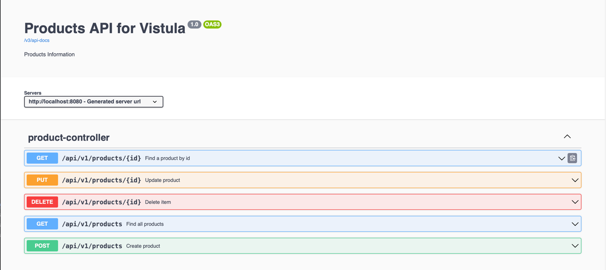

# First REST API Spring Boot Project

## **Description**
This project was created as part of an academic exercise to learn how to work with Spring Boot and integrate tools like Swagger UI (OpenAPI). The project is an example of a REST API application with web-accessible API documentation.

## **Project Structure**
- **Main Class:** `FirstRestApiApplication` – the main entry point for the application.
- **Controller:** `ProductController` – handles endpoints related to product management.
   - **Endpoints:**
      - `GET /products/{id}` – Retrieve a product by `id`.
      - `GET /products` – Retrieve a list of all products.
      - `POST /products` – Create a new product.
      - `PUT /products/{id}` – Update an existing product.
      - `DELETE /products/{id}` – Delete a product by `id`.
- **Service:** `ProductService` – contains business logic for operations like `find`, `save`, `update`, and `delete`.
- **Repository:** `ProductRepository` – an interface for communication with the database using JPA. The repository extends `JpaRepository<Product, Long>`, allowing access to CRUD methods without writing additional implementation.
- **Entity:** `Product` – represents a product entity in the database, including fields like `id`, `name`, `price`, etc.

---

## **How to Run the Project**

### **Prerequisites**
1. **Java 17** or newer installed.
2. **Maven** installed (or use the included `mvnw` wrapper).
3. An IDE such as IntelliJ IDEA.

---

### **Steps:**
1. **Clone the repository** or download the project files:
2. **Build the project**:
   ```bash
   ./mvnw clean install
   ```
3. **Run the application**:
   ```bash
   ./mvnw spring-boot:run
   ```
4. **Open in your browser**:
    - Swagger UI documentation: **`http://localhost:8080/swagger-ui/index.html`**
    - H2 console: **`http://localhost:8080/console`**

---

## **Project Features**
1. **Product REST API**:
    - `GET /products/{id}` – Find product by `id`.
    - `GET /products/` – Find all products.
    - `POST /products` – Create a new product.
    - `PUT /products/{id}` – Update an existing product by `id`.
    - `DELETE /products/{id}` – Delete a product by `id`.
2. **Exception Handling**:
    - Custom HTTP responses in case of errors (e.g., when a product is not found).
3. **API Documentation**:
    - Accessible via Swagger UI for easy testing of endpoints.

---

## **Usage Examples**

1. **Get the info of product with id 1**:

   Open your browser or Postman and go to:
   ```bash
   http://localhost:8080/api/v1/products/1
   ```
2. **Get the list of products**:  
   Open your browser or Postman and go to:
   ```bash
   http://localhost:8080/api/v1/products/
   ```
3. **Add a new product**:  
   Send a `POST` request to:
   ```bash
   http://localhost:8080/api/v1/products/
   ```
   with the following JSON body:
   ```json
   {
       "name": "Bike"
   }
   ```
4. **Update a product with id 1**
   Send a `PUT` request to:
   ```bash
   http://localhost:8080/api/v1/products/1
   ```
   with the following JSON body:
   ```json
   {
       "name": "Car"
   }
   ```

5. **Delete a product**:
   Send a `DELETE` request to:
   ```bash
   http://localhost:8080/api/v1/products/
   ```


**You can also use Swagger**:
- Go to:
```bash 
http://localhost:8080/swagger-ui/index.html
```
---

## **Technologies Used**
- **Java**
- **Spring Boot**
- **Spring Data JPA**
- **H2 Database**
- **Swagger UI**
---
